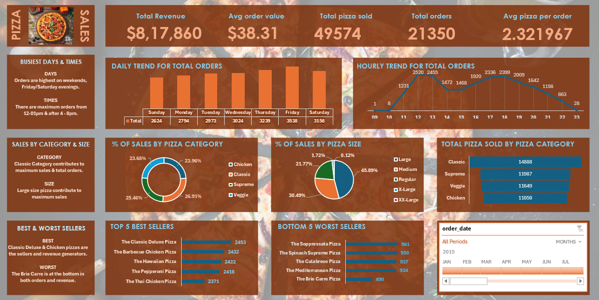

# Pizza Sales Data Analysis

## Project Overview
This project analyzes pizza sales data to uncover key business insights related to revenue trends, customer ordering behavior, and product performance. Using SQL for data exploration and data visualization for reporting, the project transforms raw transactional data into meaningful insights that support better business decision-making.

## Business Problem
A pizza business wants to understand its sales performance and customer demand patterns. The goal of this analysis is to answer important business questions such as:

- When do customers place the most orders?
- Which pizza categories generate the highest sales?
- Which pizza sizes contribute the most to revenue?
- Which pizzas are the best and worst performers?

Understanding these patterns helps businesses optimize product offerings, improve sales strategies, and increase revenue.
